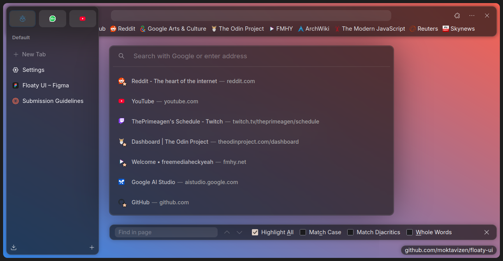

# Floaty UI

Floating Mode for Zen Browser! This mod will turn Compact Mode into Floating Mode.

## Preview



## Install

### Manual

1. Open your [`profile folder`](https://docs.zen-browser.app/guides/live-editing#step-1-access-the-profile-folder)
2. Copy and paste `chrome.css` into [`chrome folder`](https://docs.zen-browser.app/guides/live-editing#step-2-create-the-chrome-folder)
3. Open `userChrome.css` and add the following

    ```css
    @import "./zen-themes/floaty-ui/chrome.css";
    ```

4. Export your mod list from `Settings > Zen Mods > Export Mods`
5. Open the exported `json` and add the following

    ```json
    {
      "other-mods": {
        // other mods info
      },
      "floaty-ui": {
        "id": "floaty-ui",
        "name": "Floaty UI",
        "description": "Floating Mode for Zen Browser! This mod will turn Compact Mode into Floating Mode.",
        "homepage": "https://github.com/moktavizen/floaty-ui",
        "style": "https://raw.githubusercontent.com/moktavizen/floaty-ui/refs/heads/main/chrome.css",
        "readme": "https://raw.githubusercontent.com/moktavizen/floaty-ui/refs/heads/main/README.md",
        "image": "https://raw.githubusercontent.com/moktavizen/floaty-ui/refs/heads/main/preview-store.png",
        "preferences": "https://raw.githubusercontent.com/moktavizen/floaty-ui/refs/heads/main/preferences.json",
        "author": "moktavizen",
        "version": "1.0.0",
        "tags": [],
        "createdAt": "2025-06-29",
        "updatedAt": "2025-06-29",
        "enabled": true
      }
    }
    ```

6. Copy all the content and paste it inside `zen-theme.json` located in `profile folder`.
7. Restart Zen Browser
